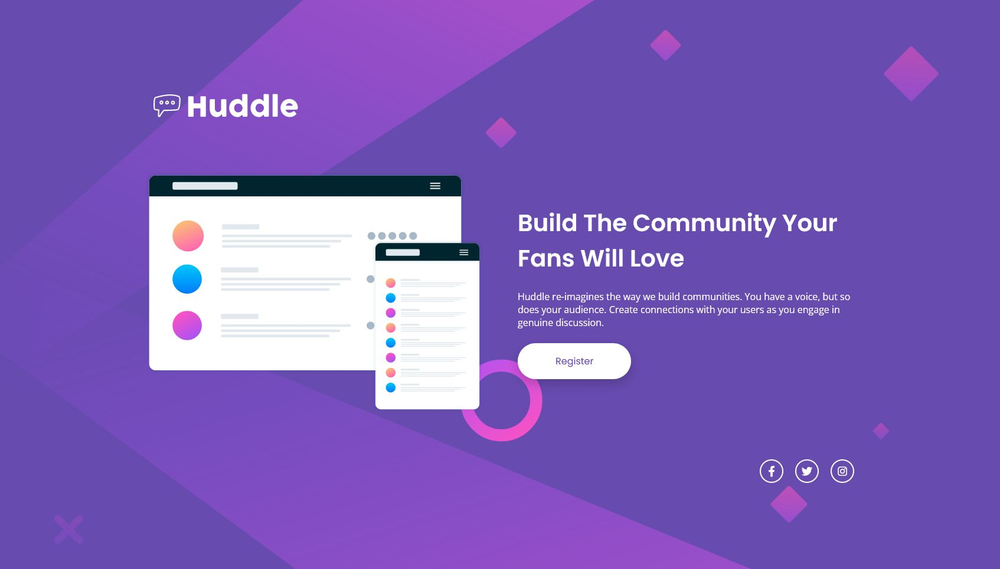

# Frontend Mentor - Huddle landing page with single introductory section solution

This is a solution to the [Huddle landing page with single introductory section challenge on Frontend Mentor](https://www.frontendmentor.io/challenges/huddle-landing-page-with-a-single-introductory-section-B_2Wvxgi0). Frontend Mentor challenges help you improve your coding skills by building realistic projects.

## Table of contents

- [Overview](#overview)
  - [Screenshot](#screenshot)
  - [Links](#links)
- [My process](#my-process)
  - [Built with](#built-with)
  - [What I learned](#what-i-learned)
- [Author](#author)

## Overview

Hi! This is my attempt at the Huddle landing page with single introductory section solution.

For this challenge, I tried to time myself to see whether I could finish within a "logical" timeframe that a front-end developer would generally take for a component/page for this level. The solution was relatively straightforward, and I approached styling with an idea in mind to have everything closer to the middle of the page for a more "modern" UI component look, as opposed to the traditional "header stuck to the top and footer stuck to the bottom" webpage look.

### Screenshot

Desktop

Mobile

### Links

- Solution URL: [Here!](https://github.com/sheronimo/frontendmentor-huddlelandingpage)
- Live Site URL: [Here!](https://sheronimo.github.io/frontendmentor-huddlelandingpage/)

## My process

1. I worked on dividing the markup first into a `header`, `main` and `footer` for semantic purposes.
2. I worked on styling the body and background.
3. I then styled each section individually before fine-tuning the spacing.
4. I then worked on the responsive styling and layout.

### Built with

- Semantic HTML5 markup
- SASS
- Flexbox
- Grid

### What I learned

I primarily learned about how to treat a whole page as a Flex container and align each component individually.

## Author

- Github - [sheronimo](https://github.com/sheronimo)
- Frontend Mentor - [@sheronimo](https://www.frontendmentor.io/profile/sheronimo)
